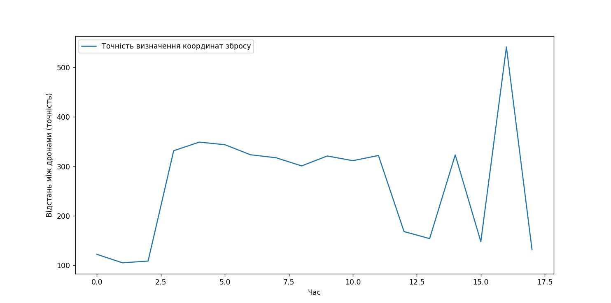

# PhD Dissertation - Readme

Welcome to the readme for my PhD dissertation project. This research explores the capabilities of drones in various scenarios and examines their performance under different conditions. The project is divided into two sub-projects, each addressing specific aspects of drone functionality and application.

## Sub-Project 1: Drone Trajectories Analysis

In this sub-project, we focus on understanding the trajectories of drones and their behavior in different scenarios. We also investigate the influence of weather conditions on their flying abilities.

### Drone Trajectories Visualization

### Avoiding Borders and Blockers

### Weather Conditions' Impact

### Realistic Drone Animations

## Sub-Project 2: Drone Search and Rescue

This sub-project provides general information about drones' capabilities in saving and detecting people in river environments. We also analyze the accuracy of measuring coordinates and the distances between drones during simulations.

### Saving and Detecting People in Rivers

### Measuring Coordinates

### Drone Distance Analysis and Coordinate Detection Accuracy

Thank you for exploring this dissertation project. Feel free to delve into each sub-project to gain a deeper understanding of the fascinating world of drones and their versatile applications.
